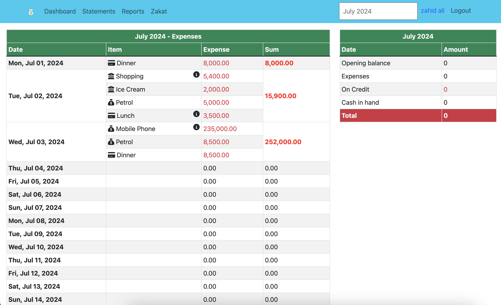
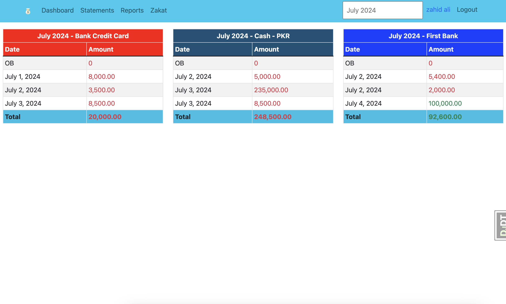
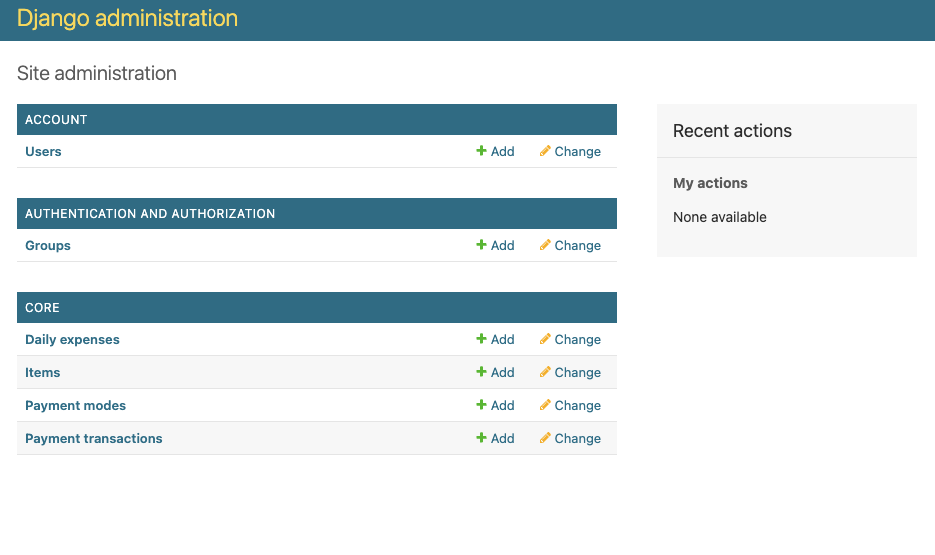

# Expense Sheet

An app for monthly expense calculator. The work is in progress

## How to setup project

1. Clone project
2. Install python 3.12.1
3. Create a virtual environment
4. Create or add sqlite3 DB file by the name `db.sqlite3`, at project root
5. Install requirements form [requirements.txt](requirements.txt)
6. Run migrations
7. Create superuser

***

## Screenshots

### Dashboard

### Statements

### Django Admin

***

## License

The code in this repository is licensed under **AGPL v3**, see details [here](LICENSE.txt)
